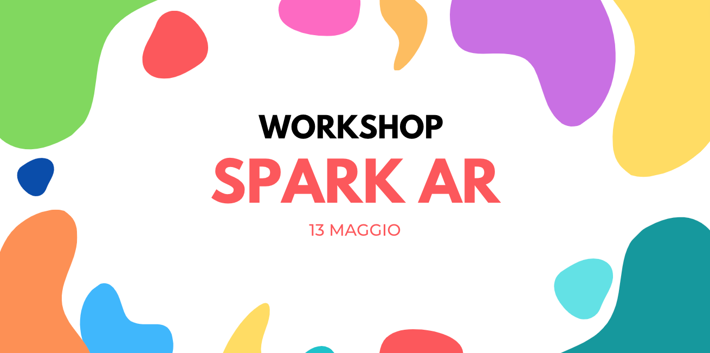

# Spark AR workshop : Italia

### Che cosa faremo?

Questa volta creeremo il nostro primo filtro artistico utilizzando Spark AR, incentrato sull'aggiunta di interattività alle nostre opere d'arte preferite.

### Cosa dobbiamo fare per iniziare?

Per questo workshop sarà solo necessario avere installato Spark AR, se vuoi creare i tuoi elementi interattivi puoi usare strumenti come Procreate, Photoshop o uno strumento simile per la modifica e la creazione di elementi visivi, non sarà necessario altro, poiché le Risorse saranno condivise per l'uso durante il workshop.

### Programma

1. [Introduzione a Spark AR](https://github.com/malvabombom/spark-ar-workshop-italia/blob/main/README.md#1-introduzione-a-spark-ar)
2. [Utilizzo di Face Tracker](https://github.com/malvabombom/spark-ar-workshop-italia/blob/main/README.md#2-utilizzo-di-face-tracker)
3. [Prova i nostri effetti](https://github.com/malvabombom/spark-ar-workshop-italia/blob/main/README.md#3-prova-i-nostri-effetti)
4. [Pubblicando il nostro filtro Spark AR](https://github.com/malvabombom/spark-ar-workshop-italia/blob/main/README.md#4-pubblicando-il-nostro-filtro-spark-ar)

## Iniziamo con il nostro primo Filtro!

### 1. Introduzione a Spark AR

### 2. Utilizzo di Face Tracker

### 3. Prova i nostri effetti

### 4. Pubblicando il nostro filtro Spark AR

